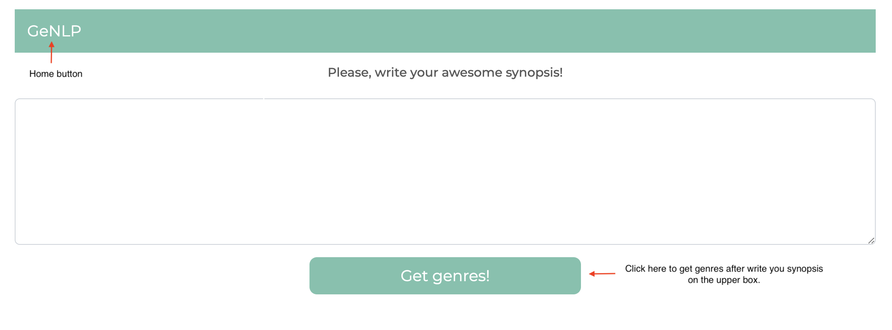

# GeNLP

GeNLP (GEnre Natural Language Processing) is a toy app where you can play with different stories to find the top 3 accurate genres based on the own story using NLP techniques.

1. How to deploy the app.
2. How to play with it.

### How To Te Deploy The App.

First of all you have to install the environment by typing

```conda env create -f environment.yml```

Then we have to activate the environment

```conda activate genlp```

and finally to run the app type

```flask run```

### How To Play With It.




